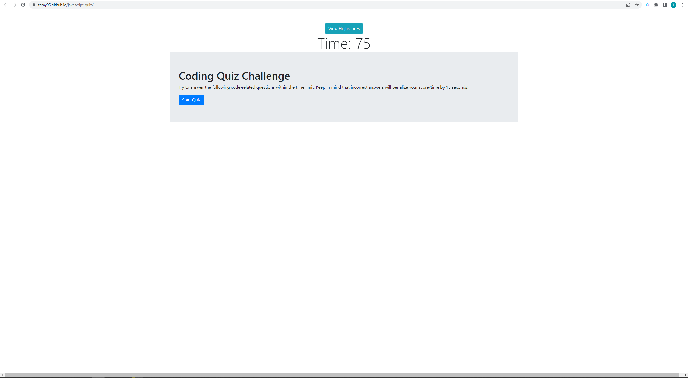

# Javascript Quiz

## Description

This web application is designed to help students study some basic information about Javascript, while storing information on user accuracy in the form of a 'high scores' page. The quiz has an initial time limit of 75 seconds, and deducts 15 seconds for each incorrect answer.

## Usage

The quiz is located at https://tgray95.github.io/javascript-quiz/, as seen in the attached screenshot. To begin quiz, click the 'start quiz' button. Choose the correct option from the list of 4 answers that appear beneath the current question. At the end of the quiz, enter your initials into the form and click 'submit' in order to save your score to a local high score list. The high score list can be accessed by clicking the 'view highscores' button.

